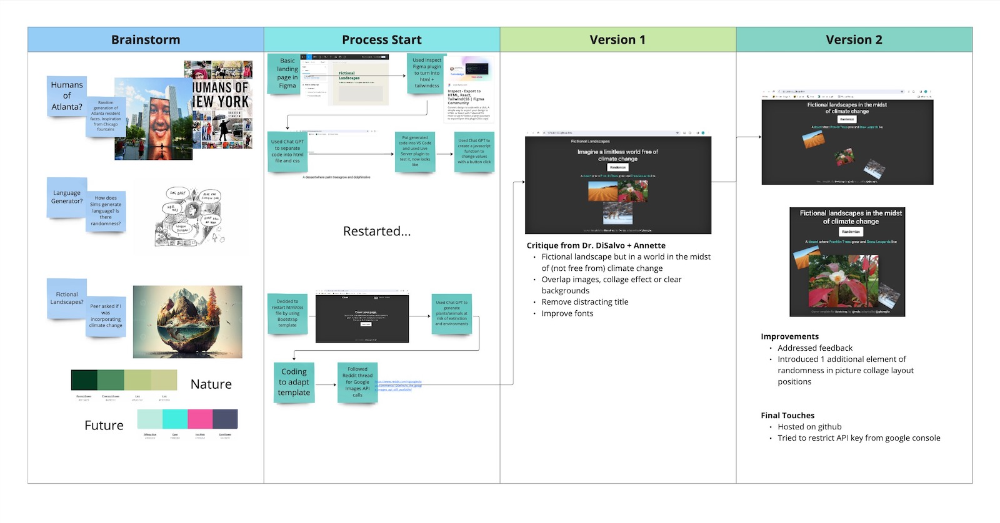

# Fictional Landscapes
This website is my submission for "A Tool for Generating Concepts" assignment at Georgia Tech for CS 8803 - Creative Design Practice taught by Dr. Carl DiSalvo at Georgia Tech. 

This website generates randomized fictional landscapes using environments, plants, and animals that are under threat of extinction due to climate change. This assignment explores both design fiction and chance. The output criticizes possible futures of bizarre, unfamiliar, and troubling realities due to climate change. Simultaneously, the website incorporates chance and random events by providing random combinations of environment + plants + animals and randomizing the position of each picture along a set path to construct randomized image layouts.

# Process 
I began by brainstorming around three potential ideas: 
- Humans of Atlanta - inspired by Humans of NY, and face fountains in Chicago
- Language Random Generator - inspired by the Sims computer game
- Fictional Landscapes - inspired by AI future world images

I began more heavily considering fictional landscapes when a peer asked if I was incorporating climate change, and then I started developing. 
I designed a simple landing page in Figma and tried using a Figma plugin and Chat GPT to generate appropriate code. I aborted this effort and restarted, instead opting for a Bootstrap template and using Chat GPT only to augment code instead of generating it from scratch. I followed a Reddit thread for implementing the Google Images API and arrived at Version 1.

# Critique and Improvements 
I received critique from Dr. DiSalvo and a classmate regarding four improvements:
- Developing the concept as a fictional landscape in a world in the midst of (not free from) climate change
- Overlapping images with a collage effect or using clear backgrounds to overlay
- Removing the distracting title
- Improving fonts

This feedback informed my edits for version 2. I then introduced one more element of randomness in the picture collage layouts generated,  hosted the website using Github Pages, and lastly, restricted the API key from the Google console.

Design Workbook Visual from Miro

# Tools
- Figma for original design
- Chat GPT for code augmentation
- Boostrap for landing page template
- Reddit for documentation navigation
- Google Console + Google Programmable Search Engine for API calls
- Github for uploading code repository
- Github pages for hosting the website

